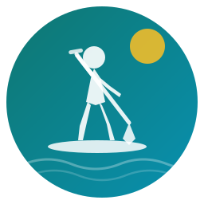

#  Paddle Conditions

[](https://opensource.org/licenses/MIT)
[](https://github.com/custom-components/hacs)
[](https://www.home-assistant.io/)

Paddle Conditions is a [Home Assistant](https://www.home-assistant.io/) custom integration that fetches weather, water, and air quality data for your paddle spots, scores each one **Go / Caution / No-go**, and shows a 24-hour forecast so you can pick the best window. All data comes from free public APIs. No accounts, no API keys, no subscriptions.

I built this because I was tired of checking four different apps before every paddle. Wind on one site, AQI on another, water temp somewhere else, streamflow on a USGS page that looks like it was designed in 1998. I paddle year-round on spots like [Lake Natoma](https://www.mklibrary.com/lake-natoma-california/), [Sand Harbor at Tahoe](https://www.mklibrary.com/sand-harbor-state-park-paddle-boarding/), and [New Bullards Bar Reservoir](https://www.mklibrary.com/new-bullards-bar-reservoir-california/), and I do [distance sessions](https://www.mklibrary.com/why-you-bonk-on-long-paddle-board-sessions/) where conditions at launch can be completely different from conditions at mile 5. I needed one place that pulled it all together and told me: should I go, or not?

---

## Table of contents

- [Features](#features)
- [Installation](#installation)
- [Configuration](#configuration)
- [Entities](#entities)
- [Scoring](#scoring)
- [Dashboard](#dashboard)
- [Data sources](#data-sources)
- [Troubleshooting](#troubleshooting)
- [Contributing](#contributing)
- [License](#license)

---

## Features

### Paddle score
- **Go / Caution / No-go rating** for any paddle location
- **7 weighted factors**: wind speed, wind gusts, AQI, temperature, UV index, visibility, precipitation
- **Hard vetoes** block automatically for thunderstorms or extreme wind
- **24-hour forecast** in eight 3-hour blocks with a "best window" pick

### Profiles
- **Paddle boarding**: Recreational, Racing, Family
- **Kayaking**: Flatwater, River, Ocean
- Each profile has its own scoring curves, weights, and veto thresholds
- Weights are customizable in the options UI

### Multiple locations
- Add as many paddle locations as you want (each is a subentry)
- Each location gets its own sensors and update cycle
- Supports lakes, rivers, and bays/oceans with the right data sources for each

### Bundled dashboard cards
Custom Lovelace cards ship with the integration. No extra HACS card downloads needed.
- `paddle-score-card`: hero score with Go/Caution/No-go rating
- `paddle-factors-card`: factor breakdown with progress bars
- `paddle-chips-card`: location navigation chips
- `paddle-forecast-card`: 3-hour forecast table with best window
- `paddle-chart-card`: Chart.js line/bar graphs for score, wind, temp, UV
- `paddle-history-card`: score history with configurable range and stats

---

## Installation

### HACS (recommended)

1. Open HACS in Home Assistant
2. Click the three dots menu > **Custom repositories**
3. Add this repository URL as an **Integration**:
   ```
   https://github.com/FrogStoneMedia/paddle-conditions
   ```
4. Search for "Paddle Conditions" and install it
5. Restart Home Assistant

<details>
<summary>Manual installation</summary>

Copy `custom_components/paddle_conditions/` to your Home Assistant `custom_components/` directory and restart.

</details>

---

## Configuration

### Adding the integration

1. Go to **Settings > Devices & Services > Add Integration**
2. Search for "Paddle Conditions" and confirm setup
3. Click the integration card, then **Add Entry** to add your first paddle location

### Adding a location

The integration ships with preset locations (Lake Natoma, Lake Clementine, Sand Harbor at Lake Tahoe, and New Bullards Bar Reservoir) that come pre-filled with coordinates and USGS station IDs. Pick a preset to start, or choose "Custom location" to enter everything yourself.

For each location you need:

| Field | Required | Description |
|-------|----------|-------------|
| Location name | Yes | A friendly name, e.g. "Lake Union" or "Deschutes River" |
| Latitude | Yes | Decimal degrees (right-click on Google Maps to copy) |
| Longitude | Yes | Decimal degrees |
| Water body type | Yes | Lake, River, or Bay/Ocean. Controls which data sources and scoring factors apply. |
| USGS station ID | No | For river streamflow data. Find yours at [waterdata.usgs.gov](https://waterdata.usgs.gov) |
| NOAA station ID | No | For water temperature and tides. Find yours at [tidesandcurrents.noaa.gov](https://tidesandcurrents.noaa.gov) |
| Optimal streamflow | No | Preferred river flow in CFS (river locations only) |

### Options

Access via the integration card > **Configure**:

| Option | Default | Description |
|--------|---------|-------------|
| Activity | Paddle Boarding | SUP or kayaking, each with its own profiles |
| Profile | Recreational | Preset weight config for your paddling style |
| Update interval | 10 min | How often to refresh data (5 to 60 minutes) |
| Factor weights | Profile defaults | Adjust individual scoring weights (auto-normalized to 100%) |

---

## Entities

Each location creates 12 sensors:

| Entity | Unit | Description |
|--------|------|-------------|
| `paddle_score` | % | Overall score (0 to 100) with Go/Caution/No-go rating |
| `wind_speed` | mph | Current wind speed |
| `wind_gusts` | mph | Peak wind gusts |
| `wind_direction` | ° | Wind bearing in degrees |
| `air_temp` | °F | Air temperature |
| `water_temp` | °F | Water temperature (requires USGS or NOAA station) |
| `uv_index` | | UV radiation index |
| `aqi` | AQI | US Air Quality Index |
| `visibility` | mi | Atmospheric visibility |
| `precipitation` | % | Precipitation probability |
| `streamflow` | CFS | River flow rate (river locations only, requires USGS station) |
| `condition` | | Weather description (e.g. "Clear sky", "Thunderstorm") |
| `forecast_3hr` | | 3-hour forecast blocks with per-block scores |

### Paddle score attributes

The `paddle_score` sensor exposes these attributes:

- `rating`: GO, CAUTION, or NO_GO
- `activity`: current activity (sup or kayaking)
- `profile`: active scoring profile
- `limiting_factor`: the condition hurting your score the most
- `factors`: individual scores for each weather factor
- `veto`: whether a hard veto is active (e.g. thunderstorm)

### Forecast attributes

The `forecast_3hr` sensor provides:
- Up to 8 forecast blocks (24 hours)
- Each block has score, rating, wind, temperature, UV, start/end times
- `best_block` and `best_score` answer "when should I go?"

---

## Scoring

Seven factors are scored individually using piecewise linear curves matched to your profile, then combined by weighted average:

| Factor | Recreational weight | What it measures |
|--------|-------------------|------------------|
| Wind speed | 30% | Sustained wind, the biggest factor for most paddlers |
| Air quality | 20% | US AQI, matters for extended exertion outdoors |
| Temperature | 15% | Comfort range with penalties for extremes |
| Wind gusts | 10% | Gust intensity above sustained wind |
| UV index | 10% | Sun exposure risk |
| Visibility | 10% | Fog, haze, low-visibility hazards |
| Precipitation | 5% | Rain probability |

Weights are customizable. Profiles provide good defaults: Racing tolerates more wind, Family is stricter across the board.

**Hard vetoes** override the score entirely:
- Thunderstorms (always enforced)
- Extreme wind (profile-dependent threshold)
- Dangerous AQI levels

---

## Dashboard

The integration generates a ready-to-use dashboard based on your configured locations. No manual find-and-replace needed.

### Auto-generated dashboard

After you add your first location, a persistent notification appears in Home Assistant with import instructions. The dashboard YAML is generated at `custom_components/paddle_conditions/dashboard/paddle-generated.yaml` and includes all your configured locations. It regenerates automatically when you add or remove a location.

### Importing the dashboard

1. Go to **Settings > Dashboards > Add Dashboard**
2. Choose **From scratch** and create a new dashboard
3. Open the dashboard, switch to YAML mode (three dots > Edit > Raw configuration editor)
4. Paste the contents of `paddle-generated.yaml`

With multiple locations, the dashboard includes an **Overview** tab showing all your spots side-by-side, plus a detail tab for each location with conditions, forecast, and charts, and a **History** tab at the end.

### Bundled cards

All cards register automatically when the integration loads. Each card has a visual editor in the dashboard UI, no YAML needed.

- `paddle-score-card`: large hero card with score, rating, and key conditions
- `paddle-factors-card`: horizontal progress bars for each scoring factor
- `paddle-chips-card`: compact location chips for multi-spot navigation
- `paddle-forecast-card`: tabular 3-hour forecast with highlighted best window
- `paddle-chart-card`: Chart.js time-series graphs for score, wind, temp, UV
- `paddle-history-card`: historical score graph with configurable range (7d, 30d, etc.)

---

## Data sources

All APIs are free, public, and need no authentication.

| Source | Data | Required |
|--------|------|----------|
| [Open-Meteo Weather](https://open-meteo.com/) | Wind, temperature, UV, visibility, precipitation, weather codes, 48-hour hourly forecast | Yes |
| [Open-Meteo Air Quality](https://open-meteo.com/) | US AQI, PM2.5, PM10, ozone | Yes |
| [USGS Water Services](https://waterservices.usgs.gov/) | Water temperature, streamflow (CFS) | No, river locations |
| [NOAA CO-OPS](https://tidesandcurrents.noaa.gov/) | Water temperature, tide predictions | No, bay/ocean locations |

Weather and AQI are required. Without them the integration won't load.

USGS and NOAA are optional. If a station is unavailable, those factors drop out and weights renormalize automatically. All API calls run in parallel. Failed requests retry with exponential backoff.

---

## Troubleshooting

### No data after setup
- Check that your coordinates are correct (latitude ±90, longitude ±180)
- Look in **Settings > System > Logs** for `paddle_conditions` errors
- Open-Meteo may be temporarily down. The integration retries automatically.

### Water temperature or streamflow missing
- These need a USGS or NOAA station ID in your location config
- Verify your station ID at [waterdata.usgs.gov](https://waterdata.usgs.gov) or [tidesandcurrents.noaa.gov](https://tidesandcurrents.noaa.gov)
- Not all stations report all parameters. Check that yours provides the data you expect.

### Score seems wrong
- Check `limiting_factor` on the `paddle_score` entity. It tells you which condition is dragging the score down.
- Review your profile weights in **Configure**. The default profile may not match how you paddle.
- Hard vetoes (thunderstorm, extreme wind) override the calculated score entirely.

### Cards not appearing
- Cards register when the integration loads. If they don't show in the card picker, clear your browser cache or restart HA.
- Check the browser console (F12) for JavaScript errors.

---

## Contributing

See [CONTRIBUTING.md](https://github.com/FrogStoneMedia/paddle-conditions/blob/main/CONTRIBUTING.md) for development setup, testing, and guidelines.

Quick version:
- Python 3.14+, `pip install -r requirements_test.txt`
- TDD is mandatory. Write failing tests first.
- `pytest tests/ -v` to run the suite
- `ruff check . && ruff format .` for linting
- Commit prefix: `[ha-integration] Brief description`

---

## License

MIT. See [LICENSE](https://github.com/FrogStoneMedia/paddle-conditions/blob/main/LICENSE).
